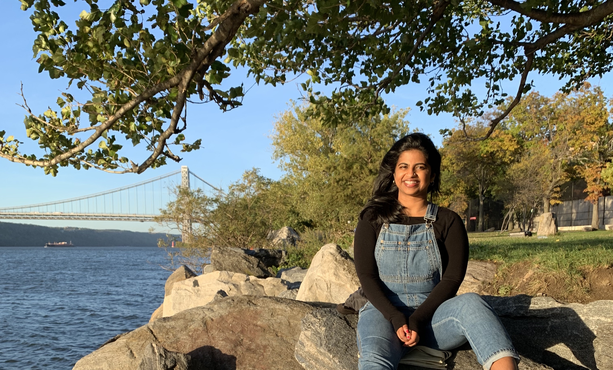

## About

I am a second-year Master's in Public Health candidate at Columbia University Mailman School of Public Health living in NYC. I believe that epidemiology is not just a powerful methodology to analyze disease, but also a way to consolidate and communicate that data to the public and policy-makers. I hope that my research in epidemiology will be my way of fighting for social justice. My past experiences as a health educator, case manager, clinical provider, contact tracer, and researcher have solidified my passion for infectious disease and health disparities epidemiology. 


GitHub: 

## Hobbies {.tabset}

### Art

An amateur oil painter and sketch artist!

```{r,out.width="49%",out.height="20%",fig.show='hold',fig.align='center'}

knitr::include_graphics(c("images/painting_1.jpeg","images/painting_2.jpeg"))
```


### Sailing

I learned sailing in high school and competed for many years. Best place to sail is Charles River in Boston.
(Just make sure you don't fall in!)


### Kathak-Indian Classical Dance

I have been learning  and practicing kathak for the last 15 years. It's been hard to practice since starting graduate school and the current pandemic. 

```{r,out.width="49%",out.height="20%",fig.show='hold',fig.align='center'}

knitr::include_graphics(c("images/kathak_1.jpeg","images/kathak_2.jpg"))
```